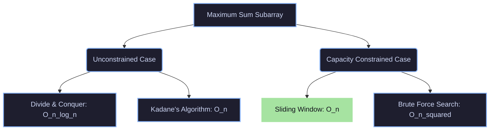

# Department of Computer Science & Engineering
## Design and Analysis of Algorithms (24CS01TH0201)

<div align="center">
  <h3>🎓 Academic Practical Submission</h3>
  <hr />
  <table style="width:100%; border:none;">
    <tr>
      <td><strong>Student Name:</strong> Advait Kawale</td>
      <td><strong>Roll No:</strong> 42</td>
    </tr>
    <tr>
      <td><strong>Section:</strong> A4 (B3)</td>
      <td><strong>Semester:</strong> 2nd Year, 3rd Semester</td>
    </tr>
    <tr>
      <td><strong>Course:</strong> Design & Analysis of Algorithms</td>
      <td><strong>Course Code:</strong> 24CS01TH0201</td>
    </tr>
  </table>
  <hr />
</div>

---

# 📊 Practical 4: Maximum Sum Subarray under Resource Allocation Constraint

## 🎯 Aim
To implement and analyze the **Maximum Sum Subarray** problem tailored for a resource allocation scenario under a specific capacity/budget constraint using algorithmic paradigms.

---

## 💡 Theoretical Overview

### 1. Problem Formulation
In resource allocation, a system is given a set of resource chunks represented as an array of values (e.g., CPU cycles, memory blocks, or monetary costs), and a maximum allowed capacity/budget constraint $C$. The goal is to select a contiguous sequence of allocations (a **subarray**) that:
1. Maximize the total resource utilization (sum of elements in the subarray).
2. Do not exceed the allocation constraint $C$.

Mathematically, given an array $A$ of size $n$ and a constraint $C$:
$$\text{Maximize } \sum_{x=i}^{j} A[x] \quad \text{subject to } \quad \sum_{x=i}^{j} A[x] \le C \quad \text{where } 0 \le i \le j < n$$

---

### 2. Paradigm Comparison: Divide & Conquer vs. Sliding Window

While the classic unconstrained Maximum Sum Subarray (Kadane's) can be solved using **Divide and Conquer** in $\mathcal{O}(n \log n)$ time, the introduction of a positive capacity constraint $C$ with non-negative allocations allows for a highly optimized **Sliding Window (Two-Pointer)** approach.



| Dimension | Divide & Conquer Approach | Sliding Window Approach (Implemented) |
| :--- | :--- | :--- |
| **Strategy** | Splits the array into halves, recursively computes left, right, and crossing max subarrays, then merges. | Expands a right pointer to utilize resources and shrinks a left pointer dynamically if capacity is breached. |
| **Time Complexity** | $\mathcal{O}(n \log n)$ | $\mathcal{O}(n)$ (linear time scan) |
| **Space Complexity**| $\mathcal{O}(\log n)$ (due to recursive call stack) | $\mathcal{O}(1)$ (in-place auxiliary space) |
| **Constraint Adaptability**| Complex to adapt when subproblem boundaries cross under tight constraints. | Highly intuitive; dynamically maintains window state. |

---

## 🧠 Algorithmic Design (Sliding Window Scan)

The implemented algorithm utilizes a dynamic sliding window bounded by a start pointer `start` and an end pointer `i`.

### Step-by-Step Execution Flow:
1. **Expansion Phase:** Iteratively add elements to the running `sum` by advancing the end pointer `i` from $0$ to $n-1$.
2. **Shrinking Phase (Constraint Validation):** If the running `sum` exceeds the constraint capacity:
   * Subtract elements from the left boundary (`start`) and increment `start`.
   * Continue until the running `sum` is within the safe capacity or the window becomes empty.
3. **Maximization Phase:** If the current valid `sum` is greater than the previous maximum record (`max`), update the optimal window indices:
   $$l = \text{start}, \quad r = i, \quad \text{max} = \text{sum}$$
4. **Feasibility Validation:** If no window satisfies the criteria, report that no feasible subarray exists.

---

## 🧪 Comprehensive Test Cases

| Case | Scenario Details | Input Array (`resources`) | Constraint | Expected Subarray | Expected Sum | Core Test Objective |
| :---: | :--- | :--- | :---: | :--- | :---: | :--- |
| **1** | Basic Small Array | `[2, 1, 3, 4]` | 5 | `[2, 1]` or `[1, 3]` | **4** | Validates basic window tracking and summation. |
| **2** | Exact Match | `[2, 2, 2, 2]` | 4 | `[2, 2]` | **4** | Tests exact boundary utilization matching capacity. |
| **3** | Single Element Match | `[1, 5, 2, 3]` | 5 | `[5]` | **5** | Ensures single-element solutions are isolated properly. |
| **4** | Out-of-Bounds Elements | `[6, 7, 8]` | 5 | *None* | **0** / *No feasible* | Verifies robust behavior when no allocation is possible. |
| **5** | Multiple Optimal Tie | `[1, 2, 3, 2, 1]` | 5 | `[2, 3]` or `[3, 2]` | **5** | Validates selection mechanics when multiple answers exist. |
| **6** | Large Feasible Window | `[1, 1, 1, 1, 1]` | 4 | `[1, 1, 1, 1]` | **4** | Verifies long sequential window tracking. |
| **7** | Dynamic Shrinking | `[4, 2, 3, 1]` | 5 | `[2, 3]` | **5** | Exercises active window left-boundary shrinking logic. |
| **8** | Empty Input Array | `[]` | 10 | *None* | **0** / *No subarray* | Robust edge handling for null/empty lists. |
| **9** | Null Capacity Constraint | `[1, 2, 3]` | 0 | *None* | **0** / *No subarray* | Correctly rejects allocations when capacity is zero. |

---

## 📊 Complexity Analysis

* **Time Complexity:** $\mathcal{O}(n)$
  * *Reasoning:* Although there is a nested `while` loop inside the main loop, the `start` pointer is only incremented. Each array element is visited and processed at most **twice** (once when added to the running sum, and at most once when subtracted from it). This guarantees a strict linear running time.
* **Space Complexity:** $\mathcal{O}(1)$
  * *Reasoning:* The algorithm executes fully in-place. Only a fixed number of scalar tracking variables (`l`, `r`, `sum`, `max`, `start`) are used, requiring constant auxiliary memory.

---

## 🚀 Execution & Compilation

To compile and run the resource allocation subarray calculator, follow these terminal instructions:

```bash
# Compile the C program using GCC
gcc MaximumSumSubarray.c -o MaximumSumSubarray

# Run the compiled executable
./MaximumSumSubarray
```

### Sample Interactive Flow:
```text
Enter size of array = 4
Enter element 1 = 2
Enter element 2 = 1
Enter element 3 = 3
Enter element 4 = 4
Enter constraint = 5

The Maximum Sum Subarray = 2 1 
Sum = 4
```
